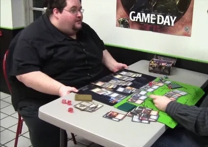

<table style="width: 80%; border-collapse: collapse;">
<tr style="border: none;">

<td width="67.5%" style="border: none; text-align: center;">
  • 👨🏻‍💻 Passionate about Technology and Development  
• 👨‍🎓 Undergraduate student in Computer Science at the State University of Londrina   
• 💻 Currently focused on:   

   
  
  

   

• 🧰 Tools:  

  
  
  

<h2 align="center">Contacts:</h2>

  

   

</td>

<td align="center" style="border: none;">
  
</td>

</tr>
</table>

<h1>🎯 Interests</h1>

<table>
    <tr>
        <td style="text-align: center;">
            
             
            
Programming

        </td>
        <td style="text-align: center;">
            
             
            
Animes

        </td>
        <td style="text-align: center;">
            
             
            
Magic The Gathering

        </td>
        <td style="text-align: center;">
            
             
            
League of Legends

        </td>
    </tr>
</table>

<h1>📊 GitHub Stats</h1>
<a href="https://github.com/LuccaGiovane">

  

